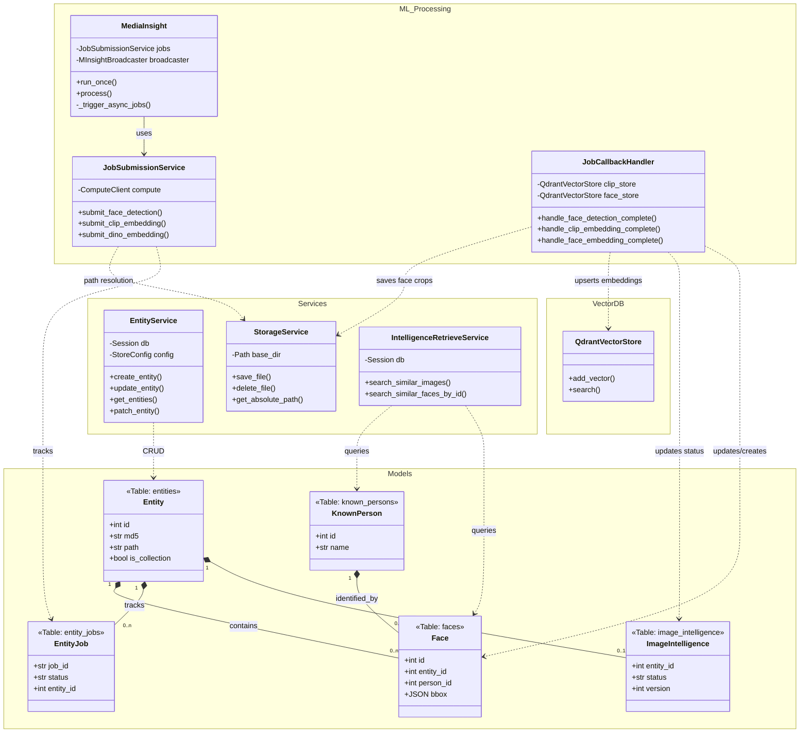

# Architecture Documentation - services/store

This document provides a detailed overview of the class structure, service relationships, and database schema for the `services/store` module.

## Class & Database Diagram

The following Mermaid diagram visualizes the interaction between the service layer, the asynchronous processing layer (m_insight), and the persistence layer (SQLAlchemy models).

## Summary of Components

### Core Services
- **EntityService**: Handles the main logic for file uploads, metadata management, and collection structure. Interacts directly with the `entities` table.
- **StorageService**: Responsible for filesystem abstraction (saving/deleting files based on MD5 paths).

### Media Insight (ML)
- **MediaInsight**: A background reconciler that compares entity versions and enqueues tasks for missing intelligence metadata.
- **JobSubmissionService**: Wraps the `ComputeClient` to submit specific tasks (CLIP, DINO, Face) to the ML worker cluster.
- **JobCallbackHandler**: The logic that runs when a job finishes. It downloads results, updates the database models, and pushes vectors to Qdrant.

### Database Schema
- **entities**: The central table for all files and folders.
- **image_intelligence**: Parallel table tracking the ML processing status and version for each image.
- **faces**: Individual faces detected within an image, linked to a `KnownPerson` if matched using embeddings.
- **known_persons**: Unique identities verified across the entire library.
