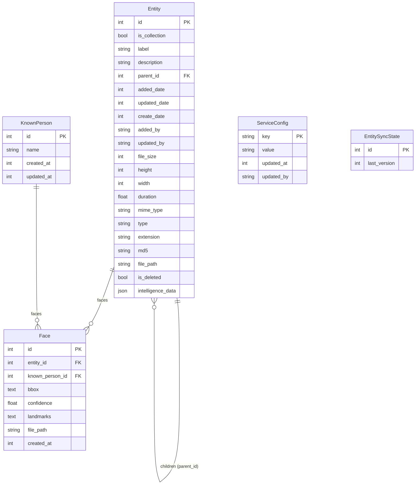
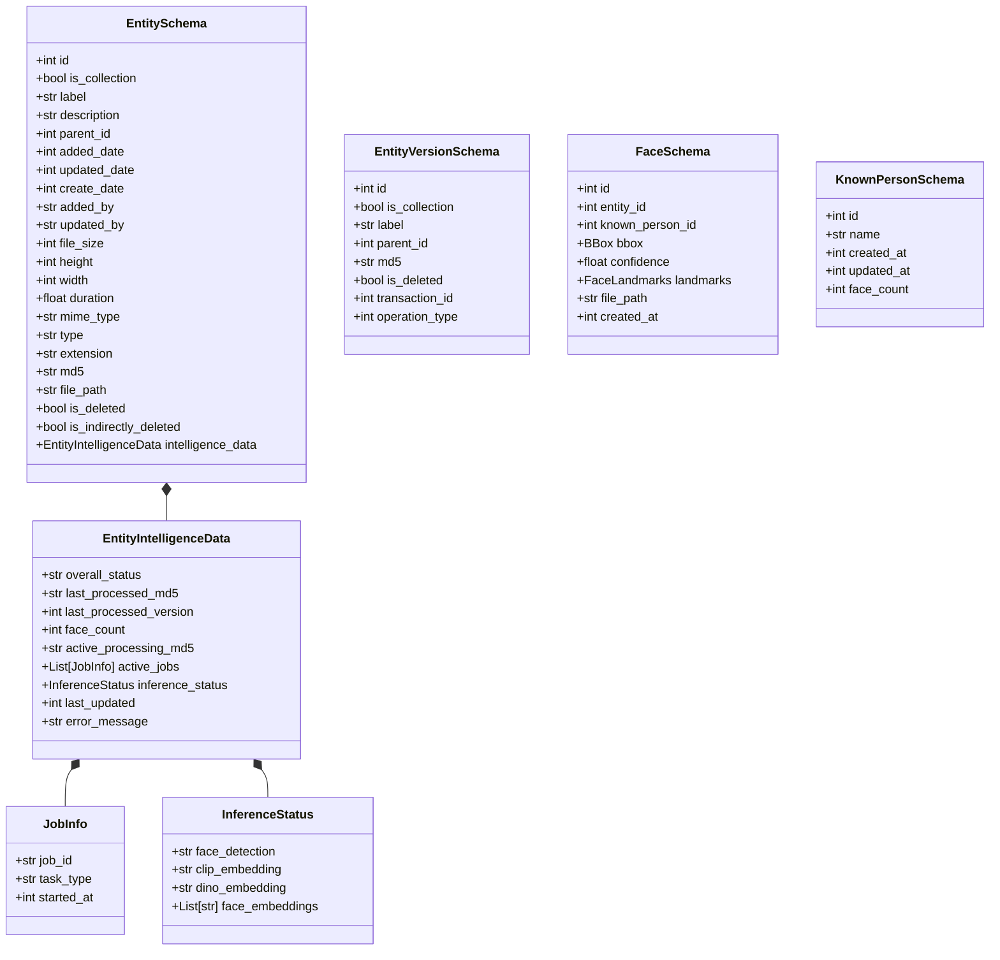
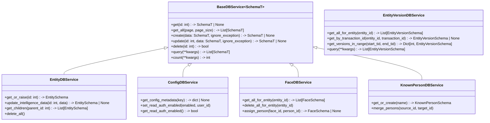

# DB Service Architecture

This document provides a visual reference for the `db_service` module, including database tables, Pydantic schemas, and available service methods.

## Database Tables (ER Diagram)

The following diagram represents the SQLAlchemy models defined in `store.db_service.models`.

## Data Schemas (Pydantic Models)

The following diagram represents the Pydantic schemas defined in `store.db_service.schemas`. These schemas are used for data exchange and API responses.

## Service Layer (API)

The data access layer consists of specialized service classes inhering from `BaseDBService`. These services handle database sessions, retries, and transaction management.

